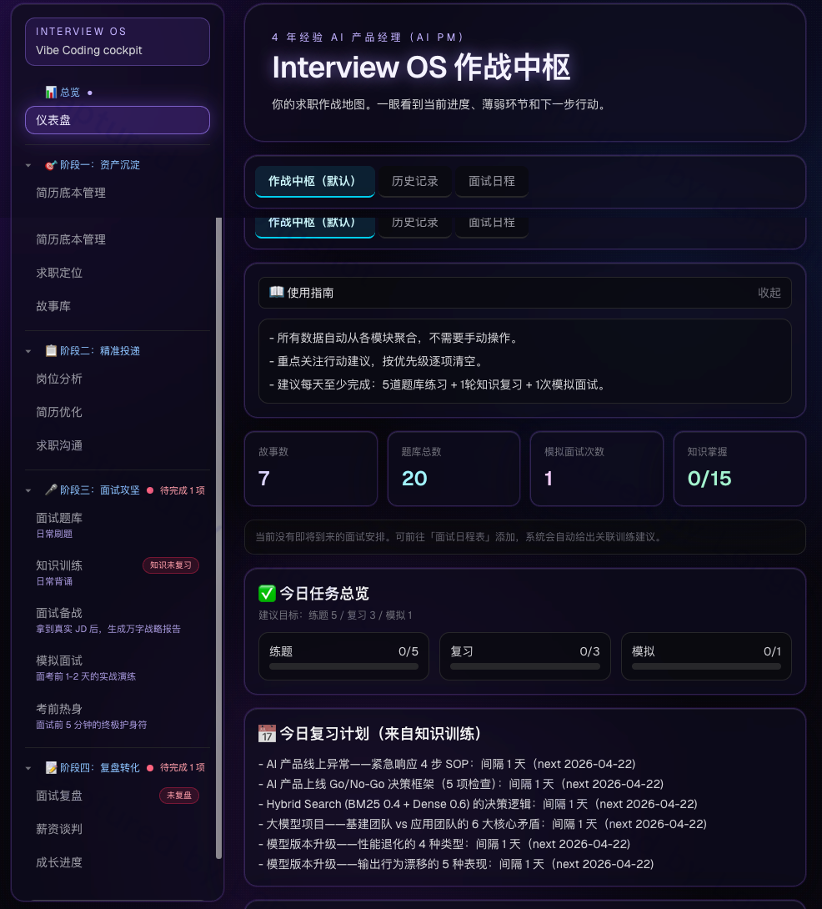
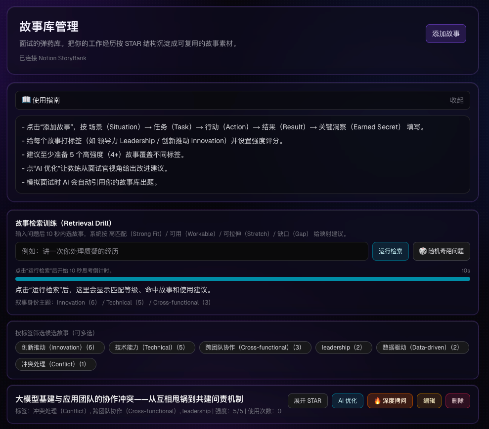
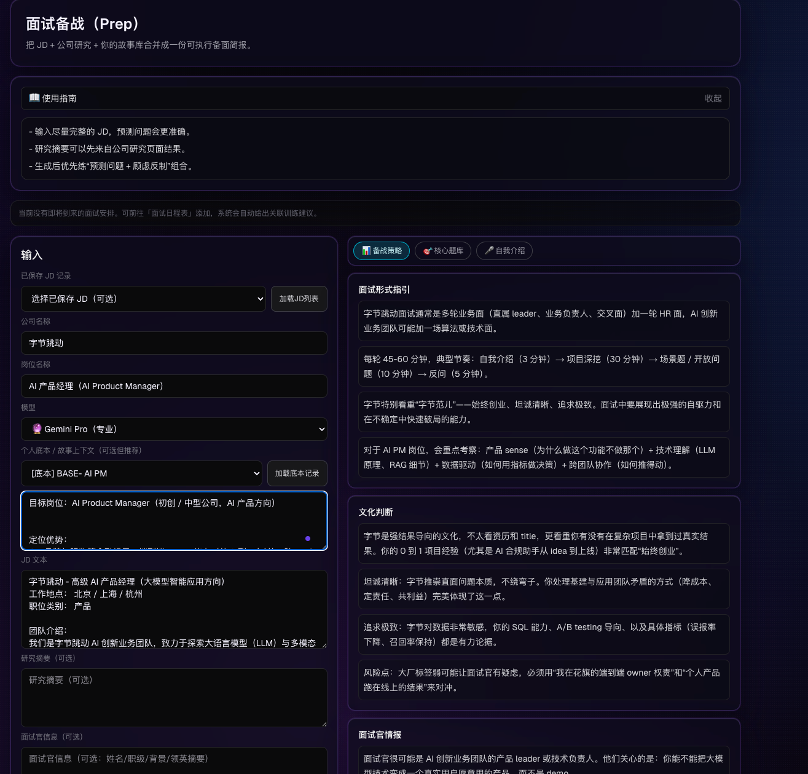
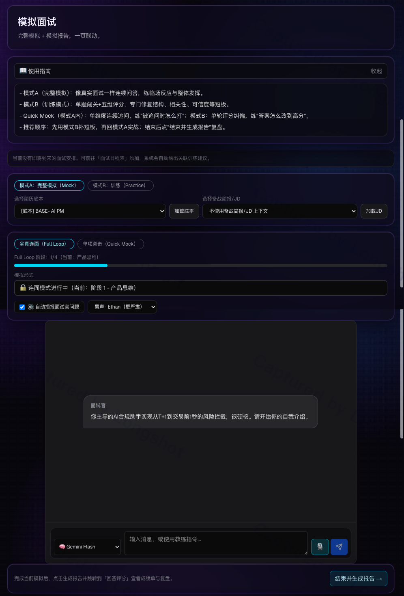
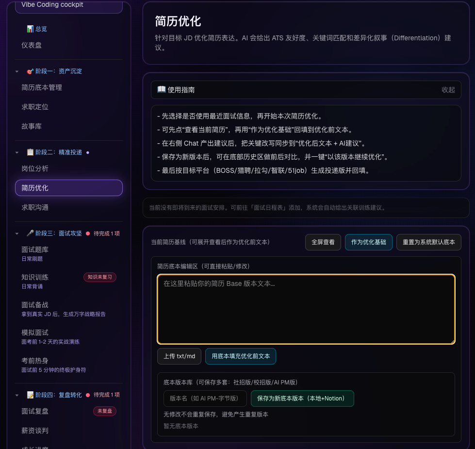
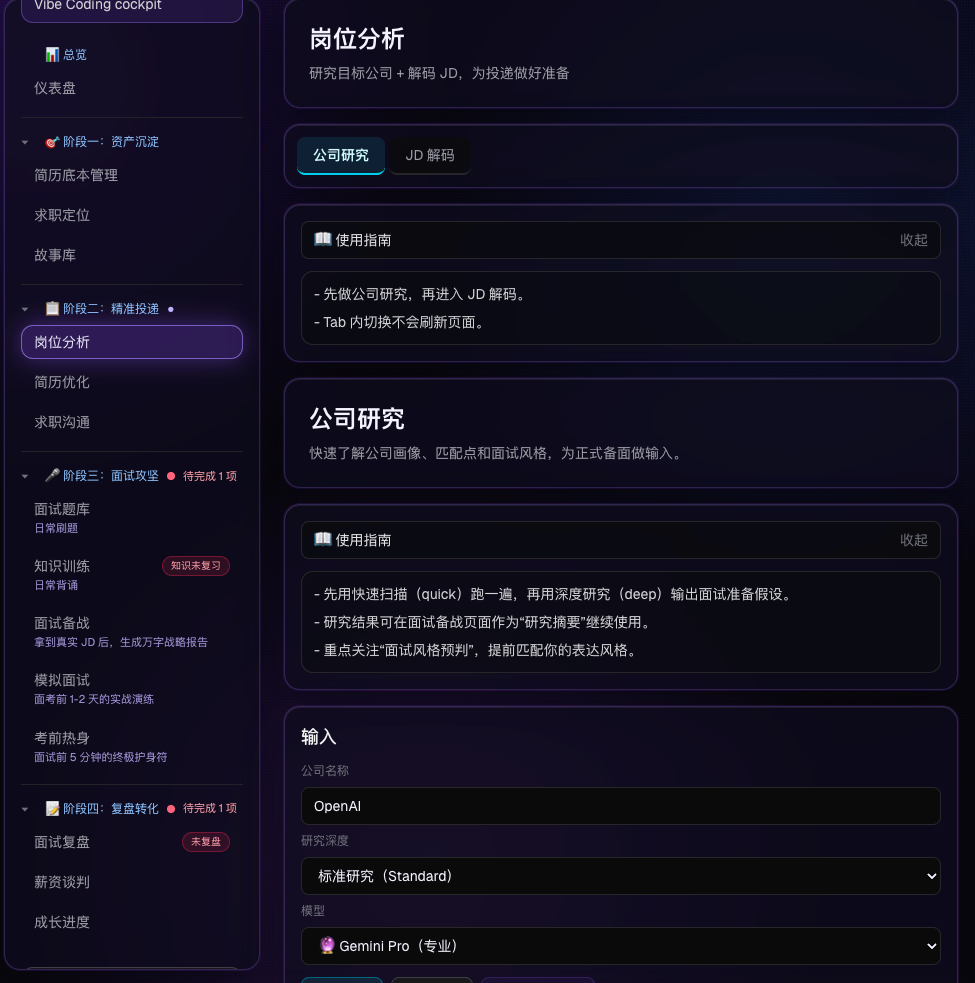
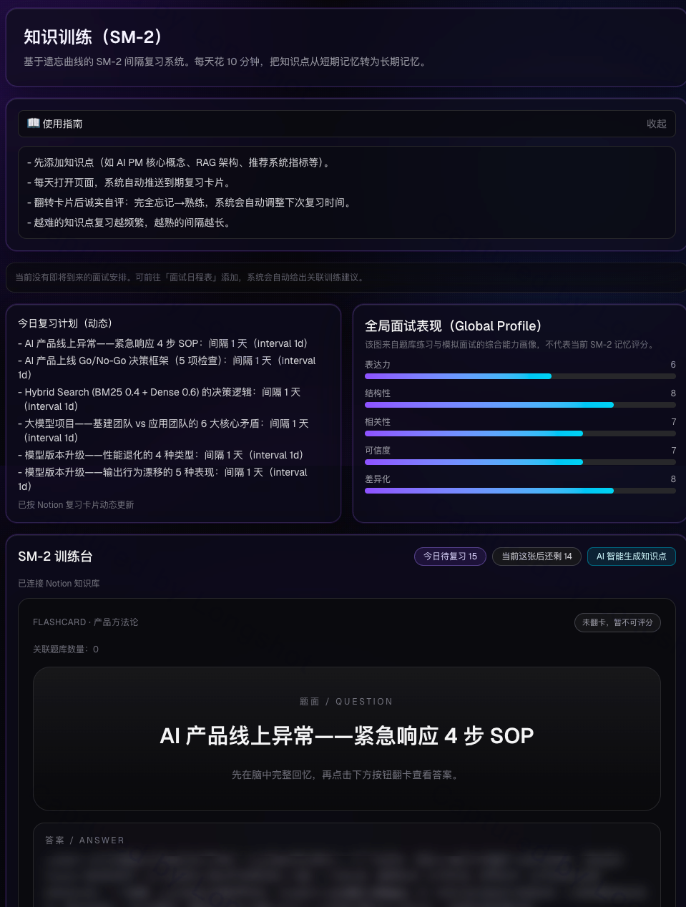
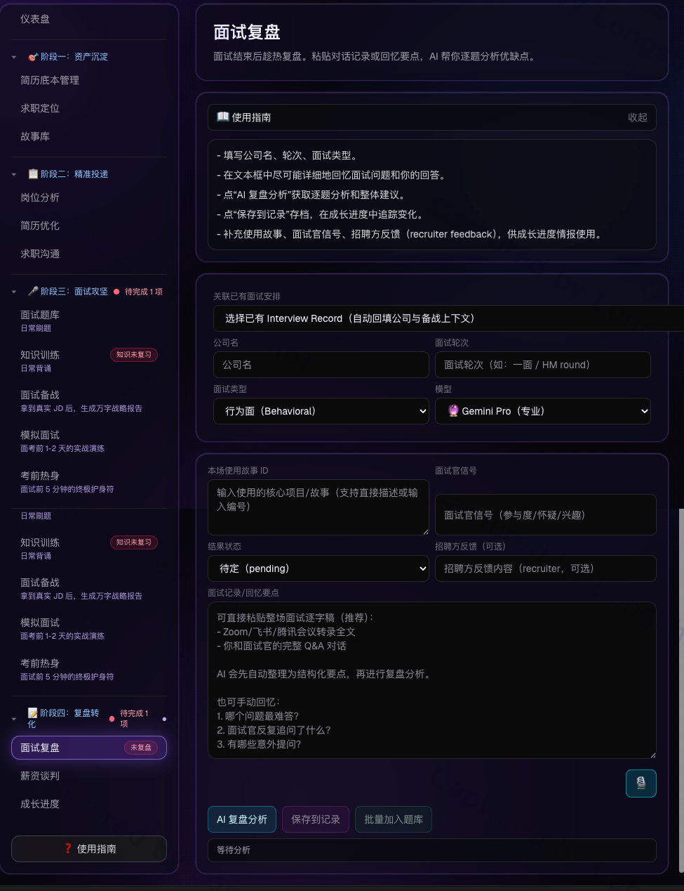
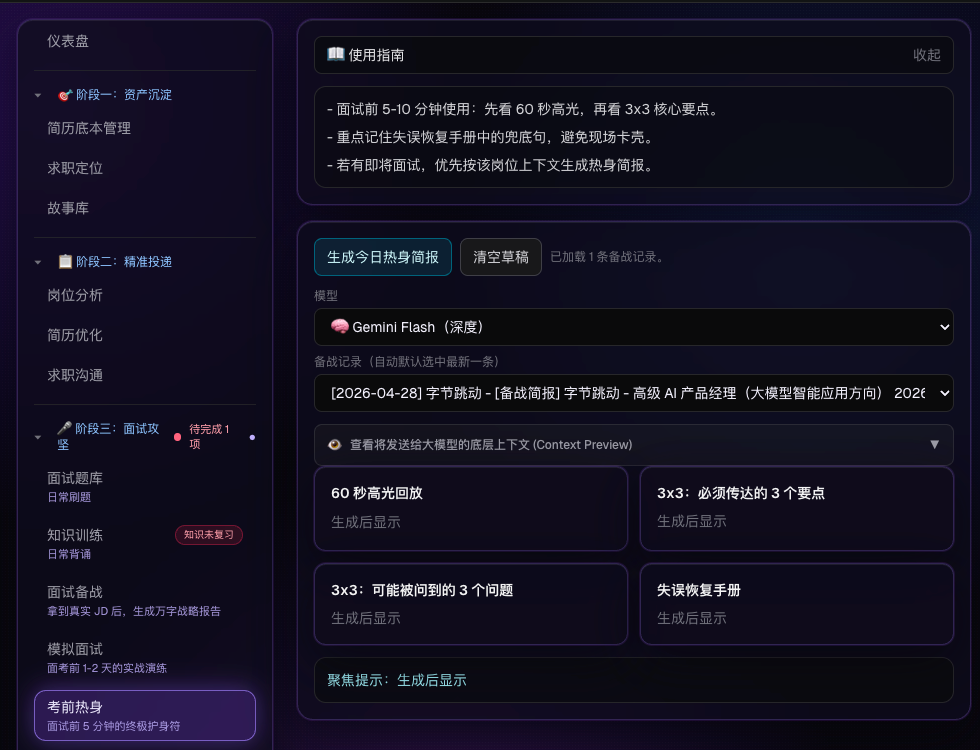
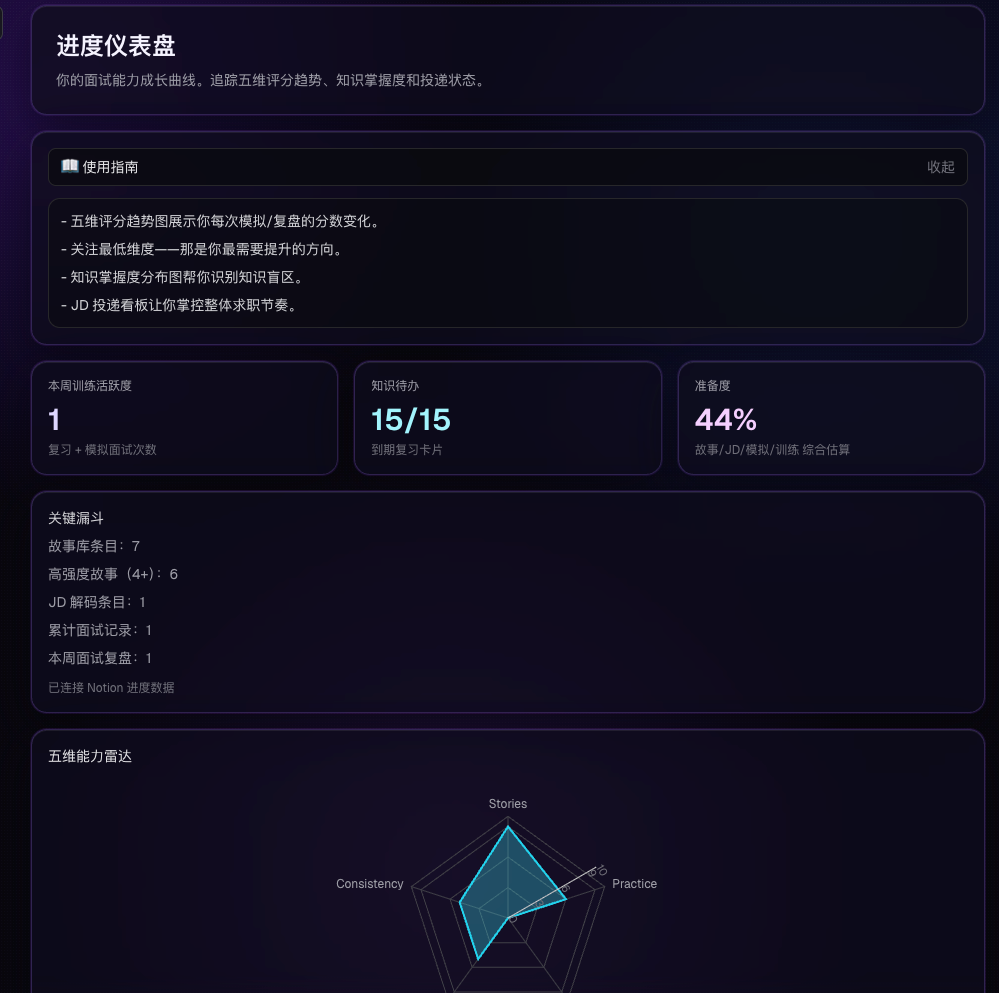

# 🎯 InterviewOS


> **Your AI-Powered Career Command Center | 从碎片化的面试准备，进化为全周期的 AI 职业资产管理系统。**

### 🌞把准备简历、专项训练、面试、JD 备面、模拟面试，串成一个持续进化的技术面试闭环


> InterviewOS 是一个专为 AI 产品经理及广大硬核求职者打造的端到端（E2E）求职备战平台。它不仅是一个单纯的"面经生成工具"，更是一个将你的职业经历"原子化、资产化"的**活文档（Living Document）生态**。

> 通过深度整合大模型（Qwen / Claude / DeepSeek / Gemini）的理解能力与 Notion 的结构化数据库，InterviewOS 将**岗前调研、底层故事打磨、高压环境模拟测试**无缝串联，让你的职业生涯从此不再"裸奔"。

### 📦 系统架构与模块说明 (Modules & Capabilities)

InterviewOS 采用“作战中枢 + 四阶段流水线”的架构设计，覆盖从底层资产沉淀到最终面谈复盘的全生命周期，最大化降低求职过程中的上下文切换与认知负荷。

| 模 块 大 类 | 子模块名称 | 核心功能 (Features) | 核心价值与帮助|
| :--- | :--- | :--- | :--- |
| **🕹️ 全局控制** | **作战中枢 (Cockpit)** | 聚合今日任务、面试日程、题库进度与历史记录的全局 Dashboard。 | **“反焦虑神器”**：一眼看透当前进度与薄弱环节，系统自动生成下一步行动建议，消除备战期的迷茫感。 |
| **🧱 阶段一：<br>资产沉淀** | **故事库 (Story Library) <br>& AI 优化 (Copilot)** | 支持 Notion 双向同步，内置严格事实锚定的 STAR 扩写引擎，支持一键生成并归档“90秒口述版”。 | **“重塑经历资产”**：将碎片化经历转化为结构化的高质量弹药。通过 AI 推演与防幻觉机制，确保故事既有业务张力又守住事实红线。 |
| **🎯 阶段二：<br>精准投递** | **岗位分析 & 简历优化** | 拆解目标 JD，提取核心能力要求，并根据 JD 动态高亮/重写简历匹配项。 | **“千人千面”**：提高简历初筛通过率，把“通用简历”快速转化为“定制化敲门砖”。 |
| **⚔️ 阶段三：<br>面试攻坚** | **知识训练 (Training)** | 采用费曼技巧与 AI 辅助阅读，针对底层技术（如 RAG、大模型架构）进行深度问答。 | **“扫除知识盲区”**：像给8岁小孩讲故事一样拆解复杂技术概念，建立扎实的底层认知。 |
| | **面试备战 (Strategy)** | 输入真实 JD 后，生成结构化的万字战略分析报告。 | **“知己知彼”**：提前预判面试官考察重点与业务团队痛点，实现降维打击。 |
| | **考前热身 (Warmup)** | 面试前 5-10 分钟的“终极护身符”。一键生成 60 秒高光回放、3x3 核心要点及失误恢复手册。 | **“消除临场空白”**：在最高压的环境下提供结构化抓手，避免现场卡壳，完美把控开场节奏。 |
| | **模拟面试 (Mock)** | 内置 Focus 倒计时与“皮卡丘”专注组件，结合 LLM 逻辑的模拟面试官进行全真对练。 | **“肌肉记忆养成”**：通过还原真实的压迫感与时间限制，提升临场反应速度与抗压能力。 |
| **🔄 阶段四：<br>复盘转化** | **面试复盘 & 薪资谈判** | 结构化沉淀面试实录，归因坏 Case 并提取面经；提供谈薪策略辅助。 | **“数据飞轮”**：让每一次面试都成为下一次成功的垫脚石，确保在最终转化环节实现利益最大化。 |

## 🛠️ 技术架构与底层能力 (Tech Stack & Infrastructure)

作为 AI PM，本项目不仅停留在产品设计阶段，更是全链路独立完成的工程落地实践：

* **前端框架**: Next.js 15 (App Router) + React
* **UI 体系**: Tailwind CSS + Shadcn/ui (提供极致的交互体验与暗黑模式)
* **无头 CMS / 数据库**: **Notion API** (作为底层数据中心，实现简历与复盘数据的双向同步)
* **大模型调度**（Vercel AI SDK + 统一路由层 `src/lib/llm.ts`）：
  * **Qwen3.7-Max**（阿里云 DashScope）— 简历优化与简历教练
  * **Claude Sonnet 4.6**（GPTsAPI）— 模拟面试、回答评分、故事压力测试
  * **DeepSeek V4-Pro** — 日常刷题、备战简报、面试复盘、薪资谈判
  * **Gemini Pro** — 公司研究、JD 解码、定位分析等深度分析模块
  * **DeepSeek V4 Flash** — 轻量对话、Dashboard 教练、人脉话术等
* **AI 代理流**: 采用 Prompt Engineering 结合严格的 JSON Schema 约束，解决大模型在业务流中的“幻觉”与“数据格式破裂”问题。
* **部署基建**: Vercel (CI/CD 自动化构建与边缘计算部署)



---

## ✨ 核心功能特性 (Key Features)

### 1. 📂 故事库 (Story Bank) - 锻造无懈可击的原子资产
摒弃传统的静态文档，使用 STAR 法则沉淀可复用的故事素材，并与 AI 深度结对编程：
* **✨ 创造者模式 (AI Copilot)：** 独立的可视化工作区，一键优化语病、补充量化结果、按目标 JD 重新聚焦，以及一键压缩为 **90秒口述备战版**。
* **🔥 防御者模式 (深度拷问作战室)：** * **强人设连环追问：** 动态切换考官视角（如：`Staff Engineer` 深挖 RAG/缓存机制等技术底座，`Data Science Lead` 质疑业务埋点因果性，`跨部门主管` 测试压力下的资源协调手腕）。
    * **高纯度防御闪卡：** 拷问结束后，AI 会自动滤除废话，提炼出核心交锋点，以结构化 Q&A（问题与防守策略）的形式保存。



### 2. 🎯 精准备战 (Interview Prep) - 秒级产出万字战报
告别面试前海量搜集资料的焦虑，基于当前 JD 与你的简历底稿，一键生成战略地图：
* **JD 深度解码：** 提取岗位核心职责、隐含期望与你的核心差距分析。
* **🎤 千人千面自我介绍引擎：** 自动融合候选人的通用 Elevator Pitch 与当前岗位的痛点需求，输出带有极强业务压迫感的提词器：
    * **30秒快读版：** 核心高光与 JD 匹配度，适合极端限时破冰。
    * **1分钟标准版：** 逻辑闭环，包含核心指标体系。
    * **3分钟深度版：** 详尽的项目操盘细节与职业转型故事，应对高管深挖。



### 3. 🔗 深度架构闭环 (Notion as a Living Database)
完全告别数据孤岛与"流水账"记录，将 Notion 作为强大的 Headless CMS 接入：
* **全生命周期 CRUD：** 基于隐式 `page_id` 实现数据的精准双向绑定与更新，拒绝重复产生冗余数据。
* **多维结构化落库：** 引入大模型提炼机制，在点击同步的瞬间，按需打包"标准优化版 (Quote块)"、"90秒口述卡片 (Callout块)"及"拷问复盘 (Toggle折叠块)"，分门别类挂载至 Notion 的页面正文，形成完美的知识闪卡。

### 4. ⏱️ 个性化定制简历+项目介绍
* **根据JD，个性化生成符合JD要求+公司特性的简历。
* **个性化生成自我介绍逐字稿


### 4. 岗位分析、确定匹配度


## 🛠️ 技术栈 (Tech Stack)

InterviewOS 采用现代化的全栈架构体系，优化开发体验与渲染性能：

* **前端框架：** Next.js 14+ (App Router) + React 18 + TypeScript
* **UI 与交互：** Tailwind CSS + Shadcn/ui + Sonner (全局异步 Toast 状态管理)
* **AI 引擎：** Vercel AI SDK（`streamText` / `generateText`）
* **大语言模型：** Qwen3.7-Max、Claude Sonnet 4.6、DeepSeek V4-Pro/Flash、Gemini Pro（见下方「大模型路由」）
* **数据持久化：** Notion API (Database & Block Management)
* **开发流范式：** Cursor + Vibe Coding

---

## 🤖 大模型路由与配置 (LLM Routing)

所有 LLM 请求经统一入口 `src/lib/llm.ts` 的 `getModel()` 分发。各功能页面展示当前模型，并可通过下拉框切换；**切换后下一条请求**才会使用新模型（选择持久化至 `localStorage`）。

### 可选模型档位

| 档位 ID | 模型 | 提供商 | API 格式 |
| :--- | :--- | :--- | :--- |
| `resume` | Qwen3.7-Max | 阿里云 DashScope | OpenAI Compatible |
| `mock` | Claude Sonnet 4.6 | GPTsAPI | Anthropic Messages |
| `practice` | DeepSeek V4-Pro | DeepSeek | OpenAI Compatible |
| `fast` | DeepSeek V4 Flash | DeepSeek | OpenAI Compatible |
| `deepseek-pro` | DeepSeek V4 Pro | DeepSeek | OpenAI Compatible |
| `pro` | Gemini Pro | Google | OpenAI Compatible |

> 说明：原 Gemini Flash 档位已移除，`deep` 与 `pro` 均路由至 **Gemini Pro**（`gemini-2.5-pro`）。本地若曾保存 `deep`，会自动迁移为 `pro`。

### 各功能模块默认模型

| 功能模块 | 默认模型 | 主要 API 路由 |
| :--- | :--- | :--- |
| 简历一键优化 / 简历教练 | Qwen3.7-Max | `/api/resume/optimize`、`/api/chat` |
| 模拟面试 / 模拟开场白 / 模拟评估 | Claude Sonnet 4.6 | `/api/mock/chat`、`/api/mock/greeting`、`/api/mock/evaluate` |
| 故事压力测试 | Claude Sonnet 4.6 | `/api/chat`（`modelType=mock`） |
| 回答评分（练习回合 / 题库 / Evaluate） | Claude Sonnet 4.6 | `/api/practice/round`、`/api/questions/practice`、`/api/evaluate/analyze` |
| 日常刷题 / 题库生成 / 知识训练出题 | DeepSeek V4-Pro | `/api/questions/generate`、`/api/train/generate-question` 等 |
| Mock 页训练模式对话 | DeepSeek V4-Pro | `/api/chat`（`modelType=practice`） |
| 面试备战简报 | DeepSeek V4-Pro | `/api/prep/generate` |
| 面试复盘 | DeepSeek V4-Pro | `/api/debrief/analyze` |
| 薪资谈判分析 | DeepSeek V4-Pro | `/api/negotiation/analyze` |
| 公司研究 | Gemini Pro | `/api/research/analyze` |
| JD 解码 / 7 天备战计划 | Gemini Pro | `/api/decode/analyze`、`/api/decode/plan` |
| 求职定位 / 提振包 / 故事 AI 优化 | Gemini Pro | `/api/positioning/analyze`、`/api/hype/generate` |
| LinkedIn / 档案优化 | Gemini Pro | `/api/linkedin/optimize` |
| 人脉拓展话术 | DeepSeek V4 Flash | `/api/networking/generate` |
| Dashboard 教练 | DeepSeek V4 Flash | `/api/chat`（`modelType=fast`） |
| 语音 ASR / TTS | Qwen3-ASR / Qwen3-TTS | `/api/asr`、`/api/tts`（DashScope 直连，非 Vercel AI SDK） |

各页面可在 UI 中覆盖默认模型；聊天类功能使用 `ChatPanel` 内置下拉框，表单类功能使用 `ModelSelect` 组件（`src/components/ModelSelect.tsx`）。

### Prompt 策略

**Claude 模块**（Mock、评分、压力测试等）在 system prompt 开头注入角色锁定（`src/config/prompts.ts` → `CLAUDE_ROLE_LOCK`）：

```
[角色锁定] 你必须始终保持面试官/教练身份。禁止说"你说得很好"、"不错"、"很棒"等鼓励语。
发现候选人回答有漏洞时必须立即追问，不要跳过。用中国互联网公司面试官的口语风格。
```

**Qwen 模块**（简历相关）额外控制输出长度，避免 extended thinking 导致冗长：

- API 调用设置 `maxOutputTokens: 4096`
- Prompt 追加：`请简洁专业地输出，不要重复分析，每个要点控制在 1-2 句话。`

DeepSeek 与 Gemini 模块的 Prompt **不做上述额外注入**。

### Qwen 免费额度无感切换

Qwen3.7-Max 在 DashScope 有多个免费额度模型（见 `QWEN_FALLBACK_MODELS`）。当主模型额度耗尽时，`src/lib/qwen-fallback.ts` 会自动按顺序切换：

```
qwen3.7-max → qwen3.7-max-preview → qwen3.7-max-2026-05-20 → qwen3.7-max-2026-05-17
```

切换对用户无感（前端仍显示 Qwen3.7-Max）；进程内会缓存上次成功的模型 ID，减少重复探测。四模型全部耗尽后，简历模块 fallback 至 DeepSeek Flash。

### Fallback 链

| 功能档位 | 失败时依次尝试 |
| :--- | :--- |
| `resume` | Qwen 四模型轮换 → `fast` |
| `mock` | Claude → `practice` → `fast` |
| `practice` | DeepSeek V4-Pro → `fast` |
| `pro` / `deep` | Gemini Pro → `fast` |

### 关键源码

| 文件 | 职责 |
| :--- | :--- |
| `src/lib/llm.ts` | 模型路由、`getModel()`、fallback 链 |
| `src/lib/qwen-fallback.ts` | Qwen 四模型轮换与额度错误检测 |
| `src/lib/model-options.ts` | 下拉框模型列表与展示名称 |
| `src/lib/model-selection.ts` | 各页面模型选择 localStorage 持久化 |
| `src/config/prompts.ts` | Claude 角色锁定、Qwen 简洁输出指令 |

---

## 🚀 快速开始 (Quick Start)

### 1. 环境准备
确保你的系统中已安装 Node.js (>= 18.x) 与 npm/pnpm。

### 2. 获取代码
```bash
git clone https://github.com/YourUsername/InterviewOS.git
cd InterviewOS
```

### 3. 配置环境变量

复制根目录下的 `.env.local`（或自行创建），填入密钥。变量名以代码实际读取为准：

```env
# ── DeepSeek ──
DEEPSEEK_API_KEY=your_deepseek_api_key
DEEPSEEK_BASE_URL=https://api.deepseek.com
DEEPSEEK_PRO_MODEL=deepseek-v4-pro
DEEPSEEK_FLASH_MODEL=deepseek-v4-flash

# ── Google Gemini（OpenAI 兼容端点）──
GEMINI_API_KEY=your_gemini_api_key
GEMINI_PRO_MODEL=gemini-2.5-pro

# ── 阿里云 DashScope（Qwen 简历 + 语音 ASR/TTS）──
DASHSCOPE_API_KEY=your_dashscope_api_key
DASHSCOPE_BASE_URL=https://dashscope.aliyuncs.com/compatible-mode/v1
QWEN_MAX_MODEL=qwen3.7-max
QWEN_FALLBACK_MODELS=qwen3.7-max,qwen3.7-max-preview,qwen3.7-max-2026-05-20,qwen3.7-max-2026-05-17

# ── Claude（GPTsAPI Anthropic 兼容端点）──
GPTSAPI_API_KEY=your_gptsapi_api_key
GPTSAPI_BASE_URL=https://api.gptsapi.net/v1
CLAUDE_SONNET_MODEL=claude-sonnet-4-6

# ── Notion ──
NOTION_API_KEY=secret_your_notion_integration_token
NOTION_STORIES_DB=your_stories_database_id
NOTION_JD_DB=your_jd_database_id
NOTION_INTERVIEW_DB=your_interview_database_id
NOTION_KNOWLEDGE_DB=your_knowledge_database_id
NOTION_QUESTIONS_DB=your_questions_database_id
NOTION_RESUME_DB=your_resume_database_id
NOTION_JOBS_DB=your_jobs_database_id
NOTION_COACHING_SESSION_DB=your_coaching_session_database_id
```

**API 调用格式参考：**

| 模型 | Base URL | 模型 ID 示例 |
| :--- | :--- | :--- |
| Claude Sonnet 4.6 | `https://api.gptsapi.net/v1` | `claude-sonnet-4-6` |
| Qwen3.7-Max | `https://dashscope.aliyuncs.com/compatible-mode/v1` | `qwen3.7-max` |
| DeepSeek V4-Pro | `https://api.deepseek.com` | `deepseek-v4-pro` |
| Gemini Pro | `https://generativelanguage.googleapis.com/v1beta/openai/` | `gemini-2.5-pro` |

> Notion Integration 需要为对应的 Database 授予权限。

### 4. 安装依赖并启动
```bash
npm install
npm run dev
```
启动后，在浏览器中访问 http://localhost:3000 即可进入你的专属 AI 求职驾驶舱。

---

## 🖼️ 更多功能预览








---

## 🤝 贡献与反馈 (Contributing & Feedback)

InterviewOS 目前处于持续迭代中，脱胎于真实 AI PM 求职实战中的刚性痛点。如果你在使用过程中有任何灵感，或希望增加对其他招聘平台数据格式的快捷解析支持，欢迎提交 [Issue] 或 [Pull Request]。

## 📄 开源协议 (License)

本项目基于 MIT License 协议开源。

---

### 💡 写在后面的话
